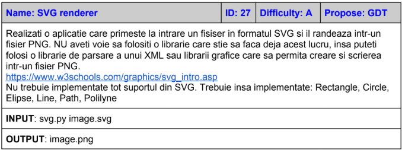

### SVG Renderer

Input: python svg-reder.py <input-file.svg>
Output: input-file.png

Dependente: pycairo, PIL, matplotlib

SVG-renderer utilizeaza la baza PIL, utilizand si pycairo datorita unor feature-uri mai optimizate. Primeste fisiere de tip SVG, si creaza reprezentarea lor in PNG. Primeste doar valori intregi ca parametrii, iar tag-urile trebuie sa fie trecute cu litera mica. 